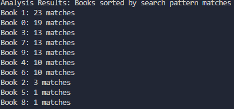

# How to run server
In the makefile there are 4 options of commands to run the server, each constituting a test.
The first option: make creating_server_sp1, runs the server on port 1234 with "the" as the search pattern.

To connect and send files to the server you can use client1, client2 or client3, with each being a different text file to send.

## How I tested 
I am on a Windows AMD-64 system and am using WSL.
I opened 11 terminals, and ran 'make creating_server_sp1' on one terminal, and on the remaining terminals I ran a combination of the different clients in the make file.

After a random amount of time I got this as an output:

It should be noted that each client was started at a different time. 